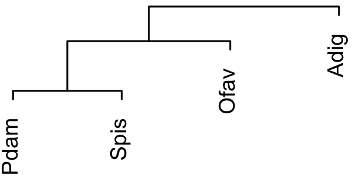
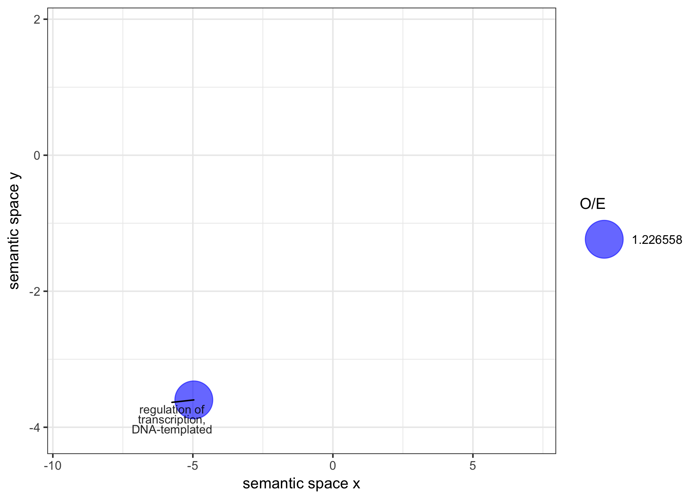
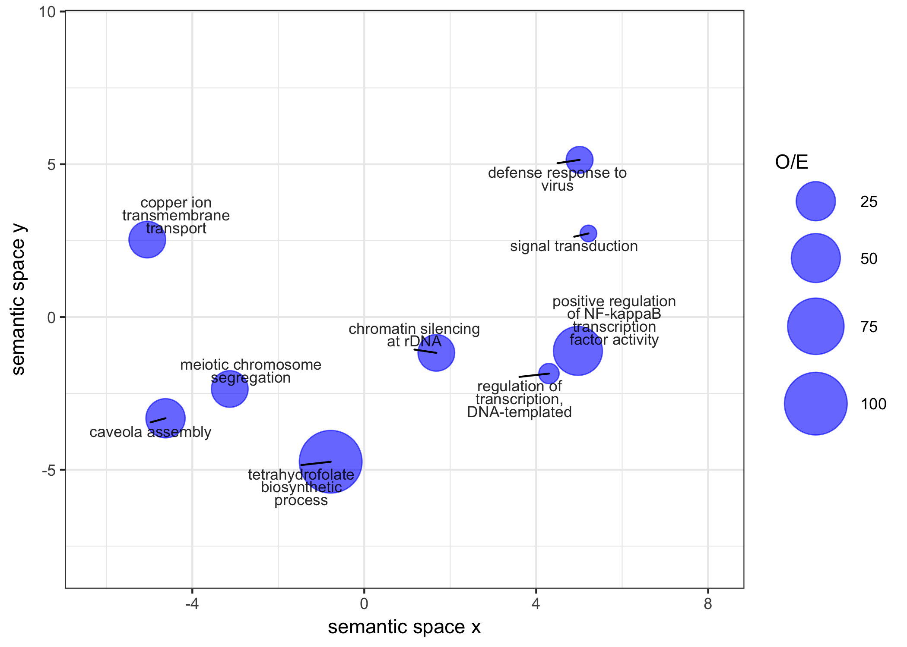
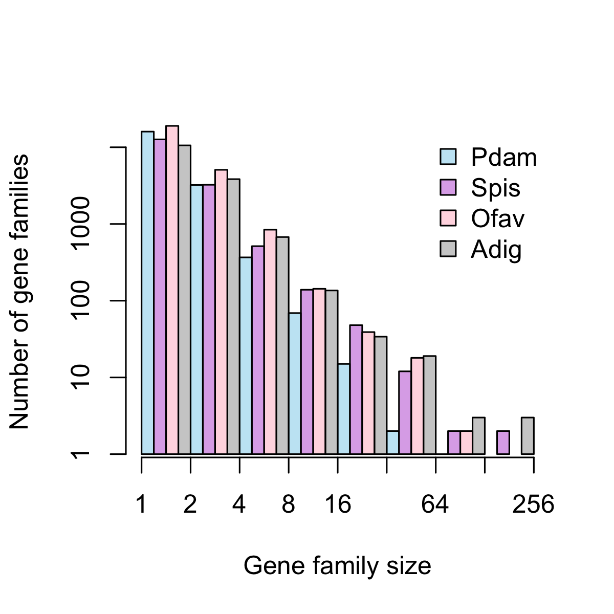
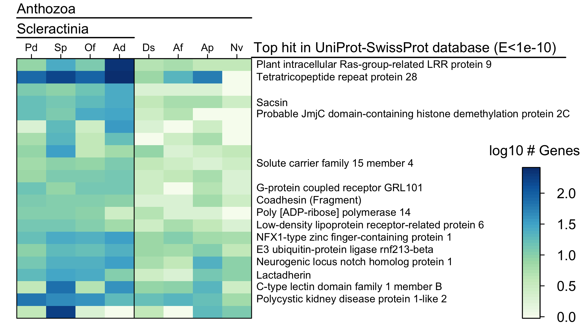
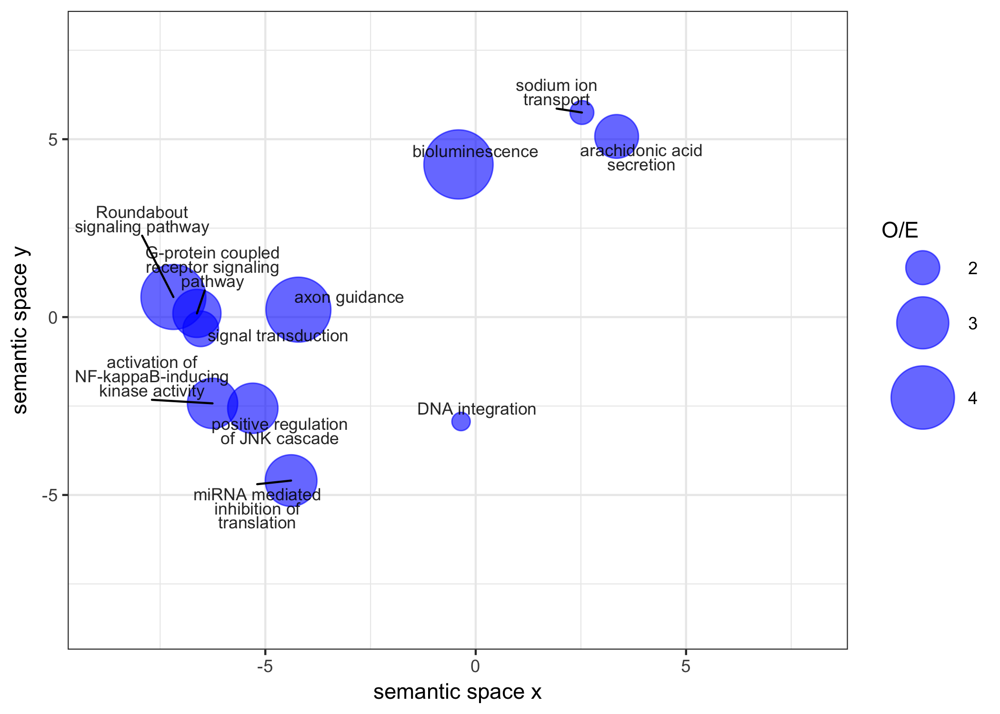

```{r setup, include=FALSE}
knitr::opts_chunk$set(echo = FALSE, warning = FALSE, message = FALSE, cache = TRUE)
knitr::opts_knit$set(root.dir = normalizePath(".."))
library(ape)
library(Biostrings)
library(stringr)
library(tidyverse)
library(VennDiagram)
library(lsmeans)
library(RColorBrewer)
```

```{r load_data_and_functions, include=FALSE}
# Load gene family count data (includes singletons)
load("fastOrtho/counts.RData")

# Define function to get total number of ortholog groups in a species (or shared by a group of species)
nfam <- function(spp) {
  out <- counts
  for (sp in spp) {
    out <- out[out[, sp] > 0, ]
  }
  nrow(out)
}

# Define function to plot venn diagram of ortholog groups across n species
plotGeneFams <- function(a, ...) {
  grid.newpage()
  if (length(a) == 1) {
    out <- draw.single.venn(nfam(a), ...)
  }
  if (length(a) == 2) {
    out <- draw.pairwise.venn(nfam(a[1]), nfam(a[2]), nfam(a[1:2]), ...)
  }
  if (length(a) == 3) {
    out <- draw.triple.venn(nfam(a[1]), nfam(a[2]), nfam(a[3]), nfam(a[1:2]), 
                            nfam(a[2:3]), nfam(a[c(1, 3)]), nfam(a), ...)
  }
  if (length(a) == 4) {
    out <- draw.quad.venn(nfam(a[1]), nfam(a[2]), nfam(a[3]), nfam(a[4]), 
                          nfam(a[1:2]), nfam(a[c(1, 3)]), nfam(a[c(1, 4)]), nfam(a[2:3]), 
                          nfam(a[c(2, 4)]), nfam(a[3:4]), nfam(a[1:3]), nfam(a[c(1, 2, 4)]), 
                          nfam(a[c(1, 3, 4)]), nfam(a[2:4]), nfam(a), ...)
  }
  if (!exists("out")) 
    out <- "Oops"
  return(out)
}

# Define function to calculate dissimilarity among species based on shared gene families
genedist <- function(a, b) {
  1 - (nfam(c(a, b)) / (nfam(a) + nfam(b)))
}

# Define function to make italic labels for plots
make.italic <- function(x) as.expression(lapply(x, function(y) bquote(italic(.(y)))))
```

# Genome statistics

|        |*Pdam*|*Spis*[^a]|*Adig*[^b]|*Ofav*[^c]|*Disc*[^d]|*Afen*[^d]|*Aipt*[^e]|*Nema*[^f]|*Hydr*[^g]|*Mlei*[^h]|*Aque*[^i]|
| --------------------- | ------ | ------ | ------ | ------ | ------ | ------ | ------ | ------ | ------ | ------ | ------ |
| Genome size (Mb)      | 348^\$^| 434    | 420    |        | 428    | 350    | 260    | 329[^e]| 1300   |        | 190
| Assembly size (Mb)    | 234    | 400    | 419    | 486    | 445    | 370    | 258    | 356    | 852    | 156    | 167
| Total contig size (Mb)| 226    | 358    | 365    | 356    | 364    | 306    | 213    | 297    | 785    | 150    | 145
| Contig / Assembly (%) | 96.3   | 89.5   | 87.0   | 73.3   | 81.9   | 82.6   | 82.5   | 83.4   | 92.2   | 96.5   | 86.8
| Contig N50 (kb)       | 25.9   | 14.9   | 10.9   | 7.4    | 18.7   | 20.1   | 14.9   | 19.8   | 9.7    | 11.9   | 11.2
| Scaffold N50 (kb)     | 326    | 457    | 191    | 1162   | 770    | 510    | 440    | 472    | 92.5   | 187    | 120
| # Gene models         | 26,077 |25,769\*| 23,668 | 37,660 | 23,199 | 21,372 | 29,269 | 27,273 | 31,452 | 16,554 | 29,867
| # Complete gene models| 21,389 |25,563\*| 16,434 | 29,679 |16,082\*|15,552\*| 26,658 | 13,343 |        |        |
| BUSCO completeness (%)| 88.4   | 72.2   | 34.3   | 71.0   |        |        |        |        |        |        |
| Mean exon length (bp) | 245    | 262\*  | 230    | 240    | 226    | 218    | 354    | 208    |        | 314    | 
| Mean intron len. (bp) | 667    | 917\*  | 952    | 1146   | 1119   | 1047   | 638    | 800    |        | 898    | 80
| Mean protein len. (aa)| 455    | 615\*  | 424    | 413    | 450\*  | 475\*  | 517    | 331    |        | 154?   | 280(med)

[^a]: Voolstra et al., bioRxiv
[^b]: @Shinzato2011
[^c]: @Prada2016a. Assembly was downloaded (https://www.ncbi.nlm.nih.gov/genome/?term=txid48498) and re-annotated using the pipeline from the present study (github.com/jrcunning/ofav-genome)
[^d]: @Wang2017a
[^e]: @Baumgarten2015
[^f]: @Putnam2007
[^g]: @Chapman2010
[^h]: @Ryan2013
[^i]: @Srivastava2010

\* Calculated in this study using GAG based on downloaded data  
\^ Calculated in this study using RepeatModeler and RepeatMasker  
^\$^ Computed as the total occurrences for non-error k-mers divided by the homozygous-peak depth (Dovetail Genomics Assembly Report)

#### Conclusions:
* Pdam assembly is most complete coral genome to date
* Genome structure is similar to other corals

***

# Feature frequency profiling based on whole proteomes
```{r ffp-tree}
tree <- ape::read.tree("ffp/tree")
tree <- root(tree, "Mnemiopsis")
tree <- drop.tip(tree, c(1,3,6))
plot(tree)
tree$tip.label <- c("O. faveolata", "P. damicornis", "S. pistillata", "A. fenestrafer", "Discosoma spp.", "A. pallida", "N. vectensis", "H. vulgaris", "A. queenslandica", "M. leidyi", "A. digitifera")
plot(tree)
```

```{r}
tree <- ape::read.tree("ffp/tree")
tree <- root(tree, "Mnemiopsis")
tree <- drop.tip(tree, c(1,3,6))
tree$tip.label <- c("Orbicella faveolata", "Pocillopora damicornis", "Stylophora pistillata", "Amplexidiscus fenestrafer", "Discosoma spp.", "Aiptasia pallida", "Nematostella vectensis", "Hydra vulgaris", "Amphimdeon queenslandica", "Mnemiopsis leidyi", "Acropora digitifera")

ggtree(tree) +
  #geom_text2(aes(subset=!isTip, label=node), hjust=-.3) +
  geom_tiplab() +
  geom_hilight(node=13, fill='darkgreen',alpha=0.3, extend=0.1) +
  geom_hilight(node=16, fill='steelblue',alpha=0.3, extend=0.1) +
  geom_hilight(node=19, fill='darkred',alpha=0.3, extend=0.12)

p <- ggtree(tree) +
  #geom_text2(aes(subset=!isTip, label=node), hjust=-.3) +
  geom_tiplab(aes(fontface = 'italic'), size = 3, vjust = -0.5, hjust = 'right') +
  #geom_tiplab(size=3, vjust=-0.5, hjust = 'right') +
  geom_cladelabel(node=13, label = "Cnidarians", offset = 0.05, 
                  angle = 270, hjust = 'center', vjust = 'bottom', fontsize = 4.5) +
  geom_cladelabel(node=14, label = "Anothozoans", offset = 0.025, 
                  angle = 270, hjust = 'center', vjust = 'bottom', fontsize = 3.5) +
  geom_cladelabel(node=16, label = "Scleractinians", offset = 0.02, 
                  angle = 270, hjust = 'center', vjust = 'bottom', fontsize = 2.5) +
  geom_cladelabel(node=17, label = "Robusta", offset = 0.015, 
                  angle = 270, hjust = 'center', vjust = 'bottom', fontsize = 2.5) +
  geom_cladelabel(node=19, label = "Corallimorpharians", offset = 0.025, 
                  angle = 270, hjust = 'center', vjust = 'bottom', fontsize = 2.5) +
  geom_hilight(node=16, fill='steelblue',alpha=0.3, extend=0.01) +
  geom_hilight(node=19, fill='darkred',alpha=0.3, extend=0.015) +
  geom_treescale()

p2 <- rotate(p, c(18))
p3 <- rotate(p2, 20)
p3

ggsave(filename = "figures/Fig1_tree.png", plot = p3, device = "png", height = 4, width = 5, units = "in")
```

# Gene content analysis

## Basic information about gene family groupings
```{r}
# How many gene families, including singletons, were found across all the genomes?
nrow(counts)  # 98,499
# How many non-singleton gene families were found across all genomes?
nrow(counts[rowSums(counts) > 1, ])  # 29,115
# How many gene families, including singletons, were found in at least one scleractinian?
scler_genefams <- counts %>%
  select("Pdam", "Adig", "Spis", "Ofav") %>%
  filter(rowSums(.) > 0)
nrow(scler_genefams)  # 43,580
# How many gene families, including singletons, were found in more than one scleractinian?
sum(apply(scler_genefams, 1, FUN=function(x) sum(x>0)>1))

# Size range of all gene families in scleractinians
range(rowSums(scler_genefams))  # 1 - 566

# Number of gene families found in 1, 2, 3, or 4 scleractinians
nscler <- as_data_frame(table(apply(scler_genefams, 1, FUN=function(x) sum(x>0))))
ggplot(nscler, aes(x=Var1, y=n)) + theme_bw() +
  geom_bar(stat="identity") +
  labs(x="Number of scleractinians with gene family", y="Number of gene families") 

```

## Number of gene families shared by scleractinian species
```{r compare_corals, results='hide'}
png(filename="figures/coral_venn.png", width=3, height=2.5, units="in", res=300)
# Compare four coral species
## Venn diagram
plotGeneFams(c("Pdam", "Adig", "Spis", "Ofav"), 
             category=make.italic(c("P. damicornis", "A. digitifera", 
                                    "S. pistillata", "O. faveolata")), 
             lty="blank", fill=c("skyblue", "pink1", "mediumorchid", "gray60"),
             cat.cex=0.75, cex=0.75, margin=0.075)
dev.off()

plotGeneFams(c("Pdam", "Ofav", "Spis", "Adig"), 
             category=make.italic(c("P. damicornis", "A. digitifera", 
                                    "S. pistillata", "O. faveolata")), 
             lty="blank", fill=c("skyblue", "pink1", "mediumorchid", "gray60"))

## Dendrogram
l <- t(combn(c("Pdam", "Spis", "Adig", "Ofav"), 2))
gd <- apply(l, 1, function(p) genedist(p[1], p[2]))
df <- data.frame(cbind(l, gd))
dm <- reshape(df, direction="wide", idvar="V2", timevar="V1")
dm <- cbind(rbind(rep(NA, 4), dm), rep(NA, 4))
dm <- dm[,-1]
rownames(dm) <- c("Pdam", "Spis", "Adig", "Ofav")
colnames(dm) <- c("Pdam", "Spis", "Adig", "Ofav")

dd <- as.dendrogram(hclust(as.dist(dm)))
dd.reorder <- reorder(dd, c(1,3,2222222,1111111))
plot(as.hclust(dd.reorder), xlab=NA, sub=NA, yaxt="n", ylab=NA, main=NA, cex=0.75)

png("figures/coral_genecontent_dendro.png", width=2, height=1, units="in", res=300)
par(mar=c(0,0,0,0))
plot(as.hclust(dd.reorder), xlab=NA, sub=NA, yaxt="n", ylab=NA, main=NA, cex=0.75)
dev.off()

```

Venn diagram shows the number of gene families shared by each of the four coral species. A pairwise similarity metric can be calculated for each pair of corals as the number of shared gene families divided by their total number of gene families (based on Snel et al. 1999). Based on this similarity metric, a dendrogram can be created showing the relationships among all four corals. Relationships based on shared gene families are consistent with evolutionary phylogeny.



***

# Functional analysis of gene content

## Coral core genes
```{r coral_core}
coralCore <- counts[apply(counts[,1:4], 1, function(x) min(x)>0), ]
n.coral.core <- nrow(coralCore)
n.coral.core  # 7,536

# Number of P. damicornis genes that are members of coral core gene families
sum(coralCore$Pdam)
sum(coralCore$Pdam) / sum(counts$Pdam)

present.all.cni <- sum(apply(coralCore[,5:9], 1, function(x) min(x)>0))
pct.all.cni <- present.all.cni / n.coral.core

present.one <- sum(apply(coralCore[,-(1:4)], 1, function(x) max(x)>0))
pct.present.one <- present.one / n.coral.core
```

The coral core genome (orthologs present in all four scleractinians) includes `r n.coral.core` gene families. Of these genes, `r round(pct.all.cni * 100, 1)`% are present in all other cnidarians, and `r round(pct.present.one * 100, 2)`% are present in at least one non-coral genome. Functional analysis of these core genes in *P. damicornis* revealed enrichment of 44 GO terms. REVIGO visualization:



## Coral-specific genes
```{r coral_specific}
coral.specific <- apply(counts, 1, function(x) min(x[1:4]>0) & max(x[-(1:4)])==0)
coral.specific.orthos <- counts[coral.specific, ]
n.coral.specific.orthos <- nrow(coral.specific.orthos)
n.coral.specific.singletons <-with(coral.specific.orthos, sum(Pdam==1 & Spis==1 & Adig==1 & Ofav==1))
n.coral.specific.genes <- sum(coral.specific.orthos[,1]) #(in Pdam)
```

This is a set of genes for which orthologs were present *in all coral genomes* but *NOT* in any of the other genomes. There were `r n.coral.specific.orthos` coral-specific gene families, including `r n.coral.specific.singletons` that were single-copy in each coral. In Pdam, these coral-specific gene families comprised a total of `r n.coral.specific.genes` genes. As above, the GO terms for these Pdam genes were tested for enrichment relative to the whole Pdam genome using topGO. Nine GO terms were significantly enriched (p < 0.05): copper ion transmembrane transport, signal transduction, tetrahydrofolate biosynthetic process, positive regulation of NFkB transcription factor, caveola assembly, defense response to virus, regulation of transcription, and chromatin silencing at rDNA, and meiotic chromosome segregation. There were 2 genes associated with copper ion transport with swissprot annotations similar to SLC31A1 copper uptake protein. There were 32 genes associated with signal transduction: SwissProt annotations associated with these genes include dopamine receptors, neuropeptide receptors, G-protein coupled receptors, and TRAF (associated with TNF-receptors). NFkB regulation, caveola assembly, and defense response to virus also likely function in immune pathways. Regulation of transcription and chromatin silencing play roles in gene expression, suggesting some coral-specific mechanisms of gene expression regulation. In addition to GO enrichment, we could also look at the blast results of the coral-specific genes, but there are 278 coral-specific ortholog groups making this very difficult to do manually....


### How many of the coral-specific genes in Pdam had annotations?
```{r}
cs_in_pdam <- read.table("coral_specific/coral_specific_pdam_gene_names.txt")  # contains the 349 coral-specific genes in Pdam

pdam_GO <- read.table("annotation/pdam_genes_GO.txt", sep="\t")  # contains GO annotations for all genes in Pdam

cs_in_pdam_with_GO_annot <- intersect(cs_in_pdam$V1, pdam_GO$V1)
length(cs_in_pdam_with_GO_annot) / length(cs_in_pdam$V1)

```

### Count number of Pdam genes with TNFR cysteine-rich domains annotated by InterProScan
```{bash}
grep "TNFR" interproscan/pdam_ips.renamed.tsv > interproscan/TNFR
cat interproscan/TNFR | cut -f1 | uniq | wc -l
```

## Genes diversified in corals
```{r coral_diversified}
coral <- 1:4
morph <- 5:6
anem <- 7:8
noncoranth <- 5:8
minanth <- apply(counts[,c(coral,morph,anem)],1,min)
sumcor <- apply(counts[,coral],1,sum)

anth <- counts[,1:8]
pgens <- anth[which(minanth>0 & sumcor>20),] # genes to test
divp <- c()
for (g in rownames(pgens)) {
  df <- data.frame(members=rep(NA,8), nonmembers=NA, group=NA)
  rownames(df) <- colnames(anth)
  df["Pdam",1:2] <- c(sum(anth[g,"Pdam"]), sum(anth[-which(rownames(anth) %in% g),"Pdam"])) 
  df["Spis",1:2] <- c(sum(anth[g,"Spis"]), sum(anth[-which(rownames(anth) %in% g),"Spis"])) 
  df["Adig",1:2] <- c(sum(anth[g,"Adig"]), sum(anth[-which(rownames(anth) %in% g),"Adig"])) 
  df["Ofav",1:2] <- c(sum(anth[g,"Ofav"]), sum(anth[-which(rownames(anth) %in% g),"Ofav"])) 
  df["Ampl",1:2] <- c(sum(anth[g,"Ampl"]), sum(anth[-which(rownames(anth) %in% g),"Ampl"])) 
  df["Disc",1:2] <- c(sum(anth[g,"Disc"]), sum(anth[-which(rownames(anth) %in% g),"Disc"])) 
  df["Aipt",1:2] <- c(sum(anth[g,"Aipt"]), sum(anth[-which(rownames(anth) %in% g),"Aipt"])) 
  df["Nema",1:2] <- c(sum(anth[g,"Nema"]), sum(anth[-which(rownames(anth) %in% g),"Nema"])) 
  df[,"group"] <- c(rep("coral",4), rep("noncoral",4))
  mod <- glm(cbind(members, nonmembers) ~ group, data=df, family="binomial")
  lsm <- lsmeans(mod, specs="group")
  lsmtest <- test(contrast(lsm, "trt.vs.ctrl", ref=2), side=">")
  divp[g] <- lsmtest$p.value
}
divadj <- p.adjust(divp,method="fdr")
divs <- pgens[divadj<0.01,]
divs
pdivGens <- dat[dat$Group%in%rownames(divs),]

n.coral.div.orthos <- nrow(divs)  # number of gene families larger in scleractinians than other anthozoans
n.coral.div.genes <- sum(divs[,1]) # number of members of these gene families in Pdam


# Get top SwissProt hits for coral-diversified proteins (using longest as representative set)
sphits <- read.table("coral_diversified/cd_longest_sp_tophits.txt", sep="\t")
sphits$V1 <- str_replace_all(sphits$V1, "-RA", "")
fams <- read.table("coral_diversified/longest_genes-fams.txt", row.names=NULL)
sphits <- merge(fams, sphits, by="V1")
sphits$labels <- stringr::str_extract(as.character(sphits$V9), " [^O]*")

# heatmap of gene family size of coral-diversified genes
rot <- function(x) "[<-"(x, , rev(x))
flip <- function(x) apply(x, 2, rot)
png("figures/coral_divgenes_heatmap.png", height=4, width=7, units="in", res=300)


par(mar=c(1,1,3.5,20), mgp=c(1.5,0.25,0), tcl=-0.25)
divs2 <- as.matrix(divs)
divs2 <- t(log10(divs2[hclust(dist(divs2))$order,]))
divs2 <- divs2[c(8,7,5,6,3,4,2,1), ]
hits <- sphits[match(colnames(divs2), as.character(sphits$V2.x)), "labels"]
pal <- brewer.pal(n=9, "GnBu")
GnBu <- colorRampPalette(brewer.pal(n=9, "GnBu"))
image(flip(divs2), col=GnBu(50), axes=F)
box()
axis(side=3, at=quantile(par("usr")[1:2], c(1, 3, 5, 7, 9, 11, 13, 15)*0.0625),
     labels=rev(c("Nv", "Ap", "Af", "Ds", "Ad", "Of", "Sp", "Pd")), cex.axis=0.75)
abline(v=0.5)
text(par("usr")[2]+0.01, quantile(par("usr")[3:4], seq(0.025,0.975,len=21)), hits, xpd=NA, adj=0, cex=0.75)
mtext(side=3, "Anthozoa", line=2.5, adj=0)
segments(par("usr")[1], 1.19, par("usr")[2], 1.19, xpd=NA, lwd=1.5)
mtext(side=3, "Scleractinia", line=1.3, adj=0)
segments(par("usr")[1], 1.11, 0.5, 1.11, xpd=NA, lwd=1.5)
text(par("usr")[2]-0.03, par("usr")[4]+0.04, "Top hit in UniProt-SwissProt database (E<1e-10)", xpd=NA, pos=4)
segments(par("usr")[2], 1.03, 2.6, 1.03, xpd=NA, lwd=1.5)
fields::image.plot(flip(divs2), col=GnBu(50), axes=F, legend.only=TRUE, horizontal=FALSE,
                   smallplot=c(0.89,0.92,0.05,0.5))
text(2.45, 0.65, labels = "log10 # Genes", xpd=T, cex=1)


dev.off()

# Table with gene family size and SiwssProt annotations
colnames(sphits)[1] <- "gene"
colnames(fams) <- c("gene", "ortho")
divs$ortho <- rownames(divs)
divs$pval <- divadj[rownames(divs)]
out <- merge(divs, fams)
out2 <- merge(out, sphits, by="gene")[,c(2:11,1,13,18)]
head(out2)
colnames(out2) <- c("ortholog_group", "Pdam", "Spis", "Adig", "Ofav", "Ampl", "Disc", "Aipt",
                    "Nema", "pval", "rep_gene", "SwissProt_tophit", "E-value")
write.table(out2, file="output/Supplementary_Table_S1.txt", quote=F, row.names=F)


```

### How many of the coral-diversified genes in Pdam had annotations?
```{r}
div_in_pdam <- read.table("coral_diversified/coral_diversified_pdam_gene_names.txt")  # contains the 349 coral-specific genes in Pdam

pdam_GO <- read.table("annotation/pdam_genes_GO.txt", sep="\t")  # contains GO annotations for all genes in Pdam

div_in_pdam_with_GO_annot <- intersect(div_in_pdam$V1, pdam_GO$V1)
length(div_in_pdam_with_GO_annot) / length(div_in_pdam$V1)

```

`r n.coral.div.orthos` ortholog groups found in all cnidarians were significantly diversified in corals. As above, the genes within these families in Pdam (n=`r n.coral.div.genes`) were analyzed using topGO. Nine GO terms were enriched: oligopeptide transport, small GTPase mediated signal transduction, kidney development, protein phosphorylation, Notch signaling pathway, V(D)J recombination, positive regulation of cyclin-dependent protein serine/threonine kinase activity, metabolic process, and attachment of GPI anchor to protein. The GO enrichment suggests a lot of functionality in signaling/possibly immunity. However, with only `r n.coral.div.orthos` gene families in the coral-diversified set, it is feasible to manually look at each these genes.

## Coral species-specific gene family expansions
### Gene family size analysis
```{r genefams}
par(mar=c(3,3.75,1,1), mgp=c(1.75,0.25,0), tcl=-0.2)

cols <- c("skyblue", "mediumorchid", "pink1",  "gray60")
pdam.counts <- hist(counts$Pdam[counts$Pdam>0], breaks=2^(seq(0,8,1)), right=FALSE, plot=F)
spis.counts <- hist(counts$Spis[counts$Spis>0], breaks=2^(seq(0,8,1)), right=FALSE, plot=F)
ofav.counts <- hist(counts$Ofav[counts$Ofav>0], breaks=2^(seq(0,8,1)), right=FALSE, plot=F)
adig.counts <- hist(counts$Adig[counts$Adig>0], breaks=2^(seq(0,8,1)), right=FALSE, plot=F)

logdat <- log10(rbind(pdam.counts$counts, spis.counts$counts,
                    ofav.counts$counts, adig.counts$counts))
logdat[is.infinite(logdat)] <- NA

png(filename="figures/gene_family_size.png", width=4, height=4, units="in", res=300)
bars <- barplot(logdat, beside=T, space=c(0,0), axes=F, col=alpha(cols,0.5),
                xlab="Gene family size", ylab="Number of gene families", xpd=NA)
axis(side=1, at=c(0,4,8,12,16,20,24,28,32),
     labels=c(1,2,4,8,16,32,64,128,256))
axis(side=2, at=c(0,1,2,3,4), labels=c(1,10,100,1000,10000))
legend("topright", pch=22, pt.bg=alpha(cols, 0.5), pt.cex=1.5, bty="n",
       legend=c("Pdam", "Spis", "Ofav", "Adig"))
dev.off()

```


Pdam tends to have smallest gene families relative to other coral species. The largest gene family expansions have occurred in Acropora.

### Gene families diversified in each coral species
```{r div_other_corals}
# which are the most diversified gene families in each coral species?
# TEST DIFFS FOR ALL SHARED GENES
corals <- counts[, 1:4]
shared <- corals[apply(corals, 1, min)>0, ]
genestotest <- rownames(shared[apply(shared, 1, function(x) max(x)>=10),])
divp <- c()
for (g in genestotest) {
  adig1 <- sum(corals[g,3])
  adig0 <- sum(corals[-which(rownames(corals) %in% g),3])
  spis1 <- sum(corals[g,2])
  spis0 <- sum(corals[-which(rownames(corals) %in% g),2])
  pdam1 <- sum(corals[g,1])
  pdam0 <- sum(corals[-which(rownames(corals) %in% g),1])
  ofav1 <- sum(corals[g,4])
  ofav0 <- sum(corals[-which(rownames(corals) %in% g),4])
  tab <- matrix(c(adig1, spis1, pdam1, ofav1, adig0, spis0, pdam0, ofav0), nrow=4,
                  dimnames=list("Species"=c("Adig", "Spis", "Pdam", "Ofav"),
                                "GeneFam"=c("Member", "NonMember")))
  tab <- as.table(tab)
  divp[g] <- fisher.test(tab, simulate.p.value=TRUE)$p.value
}
padj <- p.adjust(divp, method = "fdr")
divs <- shared[names(padj[padj < 0.01]), ]


######## identify significant differences
res <- data.frame(matrix(NA, ncol=ncol(divs), nrow=nrow(divs),
                         dimnames=list("Groups"=rownames(divs), "Species"=colnames(divs))))

for (g in rownames(divs)) {
  adig1 <- sum(corals[g,3])
  adig0 <- sum(corals[-which(rownames(corals) %in% g),3])
  spis1 <- sum(corals[g,2])
  spis0 <- sum(corals[-which(rownames(corals) %in% g),2])
  pdam1 <- sum(corals[g,1])
  pdam0 <- sum(corals[-which(rownames(corals) %in% g),1])
  ofav1 <- sum(corals[g,4])
  ofav0 <- sum(corals[-which(rownames(corals) %in% g),4])
  tab <- matrix(c(adig1, spis1, pdam1, ofav1, adig0, spis0, pdam0, ofav0), nrow=4,
                dimnames=list("Species"=c("Adig", "Spis", "Pdam", "Ofav"),
                              "GeneFam"=c("Member", "NonMember")))
  tab <- as.table(tab)
  ptab <- RVAideMemoire::fisher.multcomp(tab, p.method="fdr")
  fullptab <- rcompanion::fullPTable(ptab$p.value)
  ord <- with(data.frame(prop.table(tab, 1))[1:4,], order(Freq, decreasing=T))
  fullptab.ord <- fullptab[ord, ord]
  lett <- multcompView::multcompLetters(fullptab.ord)$Letters
  lett <- lett[order(match(names(lett), colnames(divs)))]
  res[g, ] <- lett
  data.frame(prop.table(tab, 1))[1:4,]
}


obvidivs <- divs[apply(res, 1, function(x) (sum(x=="a")==1) & sum(x=="b")==3), ]
obvires <- res[apply(res, 1, function(x) (sum(x=="a")==1) & sum(x=="b")==3), ]
obvires[obvires=="a"] <- 1
obvires[obvires=="b"] <- 0
obvires2 <- sapply(obvires, as.numeric)
rownames(obvires2) <- rownames(obvires)
colSums(obvires2)

adigdiv <- obvidivs[obvires$Adig==1, ]

spisdiv <- obvidivs[obvires$Spis==1, ]

ofavdiv <- obvidivs[obvires$Ofav==1, ]

pdamdiv <- obvidivs[obvires$Pdam==1, ]

```

```{r coral_spp_diversified_heatmap}
# heatmap of gene family size in each coral species
png("figures/coral_genefams_heatmap.png", height=4, width=2, units="in", res=300)
par(mar=c(1,1,2,1), mgp=c(1.5,0.25,0), tcl=-0.25)
divs2 <- as.matrix(divs)
divs2 <- t(log(divs2[hclust(dist(divs2))$order,]))
pal <- brewer.pal(n=10, "GnBu")
image(divs2, col=pal, axes=F)
box()
axis(side=3, at=quantile(par("usr")[1:2], c(1, 3, 5, 7)*0.125),
     labels=c("Pdam", "Spis", "Adig", "Ofav"), cex.axis=0.75)
points(rep(quantile(par("usr")[1:2], 5*0.125), nrow(adigdiv)),
       quantile(par("usr")[3:4], match(rownames(adigdiv), colnames(divs2))/54) - 0.009433962,
       pch="*", cex=0.8)
points(rep(quantile(par("usr")[1:2], 3*0.125), nrow(spisdiv)),
       quantile(par("usr")[3:4], match(rownames(spisdiv), colnames(divs2))/54) - 0.009433962,
       pch="*", cex=0.8)
points(rep(quantile(par("usr")[1:2], 7*0.125), nrow(ofavdiv)),
       quantile(par("usr")[3:4], match(rownames(ofavdiv), colnames(divs2))/54) - 0.009433962,
       pch="*", cex=0.8)
dev.off()
```


```{r supp_table_s2}
# Table with gene family size and SwissProt annotations
sd_sp_tophits <- read.table("species_diversified/species_specific_expansions_tophits.txt",
                            sep="\t")
colnames(sd_sp_tophits)[1] <- "gene"
fams <- read.table("species_diversified/sd_longest_genes-fams.txt")
colnames(fams) <- c("gene", "ortho")
divs$ortho <- rownames(divs)
out <- merge(divs, fams)
out2 <- merge(out, sd_sp_tophits, by="gene")[,c(2,3,4,5,6,1,7,12)]
colnames(out2) <- c("ortholog_group", "Pdam", "Spis", "Adig", "Ofav",
                    "rep_gene", "SwissProt_tophit", "E-value")
write.table(out2, file="output/Supplementary_Table_S2.txt", quote=F, row.names=F)
```

Spis (15) and Adig (10) have most independently diversified gene fams. Ofav=1, Pdam=0.


#### Diversified in Adig
```{r div_adig}
adigdiv
```
** ORTHOMCL15: aug_v2a.12719.t1: nr: uncharacterized protein. InterProScan: nucleoside phosphorylase superfamily, P-loop containing nucleoside trophosphate hydrolase, NACHT nucleoside triphosphatase. "unintegrated": NACHT.
* ORTHOMCL77: aug_v2a.15442.t1: nr: transposon ty3 gag-pol polyprotein. InterProScan: aspartic peptidase domain/catalytic peptidase retrovirus / tetropepsins, and reverse transcriptase domain -> GO: proteolysis, aspartic-type endopeptidase activity (hydrolysis of peptide bonds). "Retroviral reverse transcriptase is synthesised as part of the POL polyprotein that contains; an aspartyl protease, a reverse transcriptase, RNase H and integrase. POL polyprotein undergoes specific enzymatic cleavage to yield the mature proteins." (InterPro RT_dom documentation)
** ORTHOMCL80: aug_v2a.03626.t1: nr: uncharacterized protein / probably serine/threonine-protein kinase roco6. SMART: Death domain. InterProScan: P-loop containing nucleoside triphosphate hydrolase, C-terminal of Roc (COR) domain, and Death domain -> GO: signal transduction and protein binding./10331/
** ORTHOMCL298: aug_v2a.15546.t1: nr: NLRC3-like. SMART: many leucine-rich repeats (LRR domains). InterProScan: "unintegrated" NACHT domain (apoptosis/MHC recognition)
** ORTHOMCL472: aug_v2a.13941.t1: nr: MAM and LDL-receptor class A domain-containing protein 2-like isoform. Interproscan: FN3, CUB, and MAM domains. may be membrane associated, signal receptor, protein binding.
** ORTHOMCL502: aug_v2a.24492.t1: nr: uncharacterized protein. InterProScan: tetratricopeptide-like helical domain superfamily. protein binding.
* ORTHOMCL2424: aug_v2a.12383.t1: nr: piggyBac transposable element-derive protein 4-like. InterProScan: transposase domain DDE_Tnp_1_7
** ORTHOMCL3871: aug_v2a.10418.t1: nr: fibrinogen alpha-2 chain-like. i think it is actually missing the fibrinogen portion within its closest blast hits that contain it. SMART found no confident domains. InterProScan: PAN/Apple domain. swissprot: lowest evalue is 0.1....
** ORTHOMCL733: aug_v2a.24144.t1: nr: probable ephrin type-B receptor. SMART: fibronectin type 3 domain. InterProScan: immunoglobin, fibronectin, "unintegrated" ephrin receptor
** ORTHOMCL9: aug_v2a.10331.t1: nr: dynein heavy chain 5 or 8. InterProScan: Dynein heavy chain family membership - lots of domains. 

#### Diversified in Spis
```{r div_spis}
spisdiv
```
* ORTHOMCL23: Spis24421: 1) collagen-like protein, or 2) complement c1q and tumor necrosis factor-related protein 9. has transposase domain. InterProScan: transmembrane structure, cysteine-rich insect antifreeze protein, collagen triple helix repeat - structural?
** ORTHOMCL100: Spis22893: nr: Proprotein convertase subtilisin/kexin type 6 / furin-like. InterProScan: protein family: peptidase s8, subtilisin-related. kexin/furin domain and galactose-binding-like domain.
* ORTHOMCL114: Spis24333: 1) pol polyprotein from type-1 retrotransposable element, 2) tyrosine kinase receptor. InterProScan: reverse transcriptase domain.
* ORTHOMCL120: Spis22596: nr: phosphatidate phosphatase PPAPDC1A / Myosin light chain kinase, smooth muscle / has reverse transcriptase domain and GIY-YIG endonuclease domain. InterProScan: 2x GIY-YIG endonuclease superfamily, 2x reverse transcriptase domain, zinc-finger. nucleic acid binding GO.
** ORTHOMCL121: Spis2941: nr: transient receptor potential cation channel subfamily A member 1-like. INterProScan: ion transport protein
** ORTHOMCL181: Spis322: similar to inhibitor of growth protein (ING protein), tumor suppressor?. InterProScan: Exonuclease, phage-type/RecB, C-terminal / ING family, zinc finger, Ulp1 protease family, C-terminal catalytic domain
* ORTHOMCL286: Spis24261: nr: RNA-directed DNA polymerase from mobile element jockey / Fibrilin-1. InterProScan: Endonuclease/exonuclease/phosphatase, DUF, Alkylated DNA repair protein AlkB, homologue 8, N-terminal
** ORTHOMCL372: Spis8530: nr: serine/threonine-protein kinase/endoribonuclease IRE1/Eq ubiquitin-protein ligase/G-protein signaling modulator 2. InterProScan: Coils.
* ORTHOMCL517: Spis11534: nr: RNA-directed DNA polymerase from mobile element jockey / Beta-hexosaminidase 1. InterProScan: reverse transcriptase domain
* ORTHOMCL606: Spis6398: nr: Tachylectin-2 / uncharacterized transposon-derived protein. InterProScan: Ribonuclease H-like domain, INtegrase core domain, Integrase catalytic domain profile, 
** ORTHOMCL706: Spis16969: nr: repressor of the inhibitor of the protein kinase-like / Phosphatidylinositol-glycan-specific phospholipase D. InterProScan: hAT family C-terminal dimerisation region, Ribonuclease H-like domain, Coil.
* ORTHOMCL707: Spis21566: nr: RNA-directed DNA polymerase from mobile element jockey / Dimethyladenosine transferase 1, mitochondrial / Coiled-coil domain-containing protein lobo-like. InterProScan: Reverse transcriptase domain.
* ORTHOMCL851: Spis21717: nr: RNA-directed DNA polymerase from transposon X-element / Nephrocystin-4 / Twinfilin-1 / G-protein coupled receptor. InterProScan: Reverse transcriptase domainq
* ORTHOMCL1742: Spis24269: nr: RNA-directed DNA polymerase / Long-chain-fatty-acid--CoA ligase 5 / FMRF-amide neuropeptide / REST corepressor 2. InterProScan: Reverse transcriptase domain.
* ORTHOMCL1901: Spis13079: nr: Pogo transposable element with KRAB domain / Arylsulfatase B. InterProScan: Winged helix-turn-helix DNA-binding domain, Homeobox domain-like, DDE superfamily endonuclease, Tc5 transposase DNA-binding domain, HTH CenpB-type DNA-binding domain, Transposase IS3/Is911family


#### Diversified in Ofav
```{r div_ofav}
ofavdiv
```
* ORTHOMCL2848: ofav_00010370: nr: Metabotropic glutamate receptor 3 / ?

#### Diversified in Pdam
```{r div_pdam}
pdamdiv
```

.....no gene families are significantly diversified in Pdam relative to all three other coral species. There are some gene families in which Pdam and another species have larger families than the other two species, but none for which Pdam is significantly higher than all three other corals.

* "The functional categories most prone to lineage-specific expansion are structural proteins, enzymes involved in an organism's response to pathogens and environmental stress, and various components of signaling pathways responsible for specificity, including ubiquitin ligase E3 subunits" (Lespinet et al. 2002)

* similar gene families have been expanded in sea cucumber genome.

***

## Pdam-specific genes

However, there are genes that were found in Pdam with NO ORTHOLOGS in the other corals. These Pdam-specific genes include...:

```{r pdam_specific}
pdam.specific <- apply(counts[,-1], 1, function(x) max(x)==0)
pdam.specific.orthos <- counts[pdam.specific, ]
n.pdam.specific.orthos <- nrow(pdam.specific.orthos)
n.pdam.specific.singletons <- sum(pdam.specific.orthos$Pdam==1)
n.pdam.specific.genes <- sum(pdam.specific.orthos[,1])

pds_gene_names <- read.table("pdam_specific/pdam_specific_gene_names.txt")
pdam_specific_genes_with_GO_annotations <- intersect(pds_gene_names$V1, pdam_GO$V1)
length(pdam_specific_genes_with_GO_annotations) / length(pds_gene_names$V1)
```

This is a functional profile of the genes in Pdam for which *no orthologs were found in any other genome* (with an e-value cutoff of 1e-5), including the other corals and the other inverts. There were `r n.pdam.specific.orthos` pdam-specific ortholog groups, including `r n.pdam.specific.singletons` singletons, containing a total of `r n.pdam.specific.genes` genes. Eleven GO terms were significantly enriched: G-protein coupled receptor signaling pathway, bioluminescence, activation of NFkappaB-inducing kinase activity, positive regulation of JNK cascade, and signal transduction.



```{r}
pdam_specific <- read.csv("pdam_specific/pdam_specific_enrichment_data.csv", stringsAsFactors = F)
pdam_specific <- pdam_specific[, c(1,2,4,5,9)]
colnames(pdam_specific) <- c("GO Accession", "GO Term Name", "Observed", "Expected", "p")
pdam_specific[1,2] <- "G-protein coupled receptor signaling pathway"
pdam_specific[3,2] <- "activation of NF-kappaB-inducing kinase activity"
write.csv(pdam_specific, "output/Table3_pdam_specific_GO_enrichment.csv", row.names=F, quote=F)

knitr::kable(pdam_specific, output="markdown", caption="Enrichment of GO terms in the P. damicornis-specific gene set.")
```


